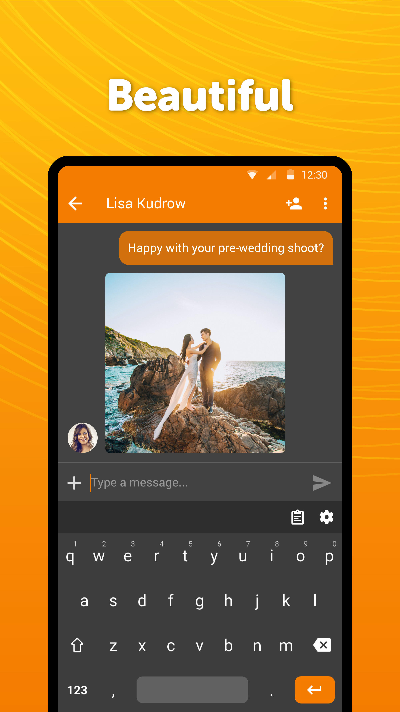
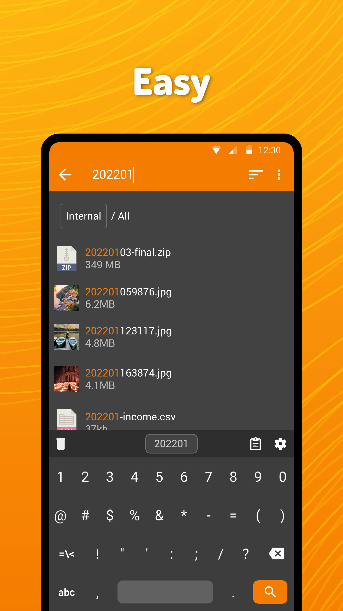
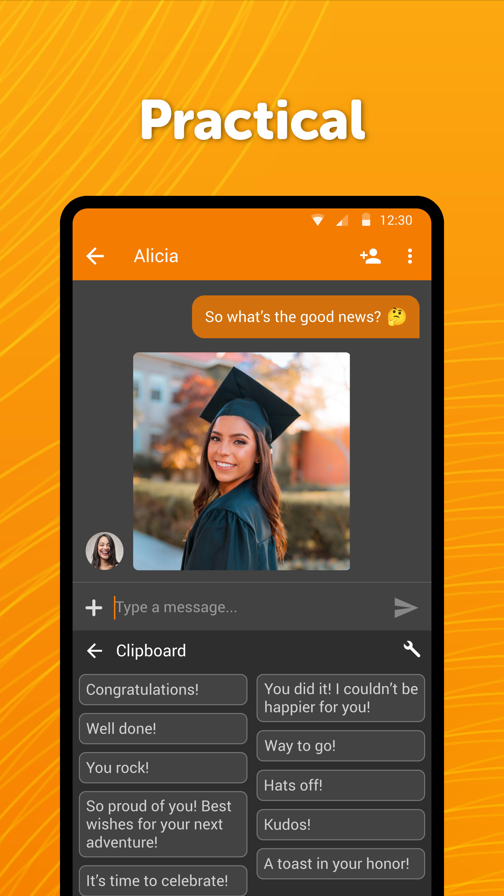

# Simple Homoglyph Keyboard

A lightweight keyboard app that helps chatting with your friends, inserting texts, numbers, or symbols, and enhances pseudo-privacy with homoglyph character replacements. Choose from multiple languages and layouts, and toggle homoglyphic and noise features to protect against AI and machine learning analysis.

**Features Include:**
- **Homoglyphics Toggle**: Replaces characters with visually similar alternatives to add an extra layer of obfuscation.
- **Noise Toggle**: Introduces random noise, such as invisible characters and random case variations, subtly disrupting pattern recognition technologies without affecting readability.

This app operates without internet access, offering more privacy, security, and stability than other keyboard apps. Contains no ads or unnecessary permissions and is fully open-source.

<a href="https://f-droid.org/packages/com.tlorien.keyboard">Get it on F-Droid</a>

Support the development:  
- **PayPal**: [Donate via PayPal](https://paypal.me/SimpleMobileTools?country.x=SK&locale.x=en_US)
- **Patreon**: [Support on Patreon](https://www.patreon.com/tiborkaputa)

